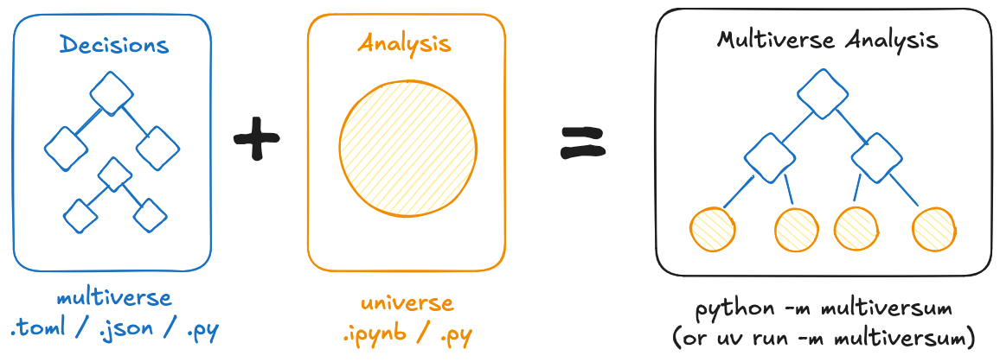

# multiversum

[](https://pypi.org/project/multiversum/)
[](https://github.com/jansim/multiversum/actions/workflows/test.yml)
[](https://github.com/jansim/multiversum/releases)
[](https://github.com/jansim/multiversum/blob/main/LICENSE)

<p align="center">
  
</p>

_multiversum_ is a package designed to make it easy to conduct multiverse analyses in Python. The package is intended to seemlessly integrate into a normal analysis or ML workflow and can also be added to an existing pipeline.

### Features

- **Simple** 🧩: Built with the goal of being as simple as possible to integrate into existing workflows.
- **Parallel** 👯: Different universes are automatically evaluated in parallel.
- **Notebooks** 📓: Analyses can be written as Jupyter notebooks or Python scripts.
- **Play/Pause** ⏯️: Interrupt and then continue a multiverse analysis where you left it.

## Installation

Install this library using `pip`:
```bash
pip install multiversum
```

## Usage



The package always works with two different files: The `multiverse.py` (or toml / json) ✨️, specifying the different dimensions (and their options) and the `universe.ipynb` (or py) ⭐️ containing the actual analysis code. The universe file is then evaluated (in parallel) using different dimension-combinations, by running `python -m multiversum`.

### Examples

Here's a simple example of how to use _multiversum_ to classify penguins 🐧.

=== "multiverse.py ✨️"

    ```python
    from multiversum import Config

    # Configure the multiverse itself
    config = Config(
        # Specify the decisions / dimensions and their options
        dimensions={
            "classifier": ["logistic", "random_forest"],
            "feature_set": ["minimal", "standard", "full"],
        },
    )
    ```

=== "universe.py ⭐️"

    ```python
    # Implement the actual analysis

    import pandas as pd
    from sklearn.linear_model import LogisticRegression
    from sklearn.ensemble import RandomForestClassifier
    from sklearn.model_selection import train_test_split
    from sklearn.metrics import accuracy_score
    from multiversum import Universe

    # Initialize the Universe with example settings for development
    # These will automatically be overwritten by multiversum in the analysis
    universe = Universe(settings = {
        # Automatically overwritten
        "classifier": "logistic",
        "feature_set": "standard",
    })
    seed = universe.seed

    # Load the data
    df = pd.read_csv("https://raw.githubusercontent.com/allisonhorst/palmerpenguins/main/inst/extdata/penguins.csv")

    # Prepare data based on feature_set dimension
    X = None
    if universe.dimensions["feature_set"] == "minimal":
        X = df[["flipper_length_mm"]]
    elif universe.dimensions["feature_set"] == "standard":
        X = df[["flipper_length_mm", "bill_length_mm"]]
    elif universe.dimensions["feature_set"] == "full":
        X = df[["flipper_length_mm", "bill_length_mm", "bill_depth_mm"]]
    
    y = df["species"]
    
    # Split data
    X_train, X_test, y_train, y_test = train_test_split(X, y, test_size=0.2, random_state=seed)
    
    # Choose classifier based on dimension
    model = None
    if universe.dimensions["classifier"] == "logistic":
        model = LogisticRegression(random_state=seed)
    elif universe.dimensions["classifier"] == "random_forest":
        model = RandomForestClassifier(random_state=seed)
    
    # Train model
    model.fit(X_train, y_train)
    
    # Evaluate
    y_pred = model.predict(X_test)
    accuracy = accuracy_score(y_test, y_pred)
    
    # Prepare
    results = pd.DataFrame({
        "accuracy": [accuracy],
        "feature_count": [len(X.columns)]
    })

    # Let multiversum handle the storage / saving
    universe.save_data(results)
    ```

=== "Running the analysis 🚀️"

    With the files ready, you can then run the actual analysis!

    ```bash
    python -m multiversum
    ```

    This will create all possible combinations of the dimensions specified in `multiverse.py` and run the analysis in `universe.py` for each of them.
    
    The results will be saved in a new `outputs/` directory, including both an aggregated file and individual data from each universe to help you understand what exactly happend.

    If you are using `uv` to manage your Python projects, you can run the analysis via:

    ```bash
    uv run -m multiversum
    ```

Another example using a machine learning workflow in `scikit-learn` can be found [here](../examples/scikit-learn--simple/).

## Parallel Execution

By default, _multiversum_ will run your analysis in parallel using all available CPU cores except one. This behaviour can be controlled using the `n_jobs` parameter:

```bash
# Use 4 CPU cores
python -m multiversum --n-jobs=4

# Use all CPU cores
python -m multiversum --n-jobs=-1

# Disable parallelization (sequential execution)
python -m multiversum --n-jobs=1
```

### Distributed Execution across Multiple Machines

For very large analyses that need to run across multiple machines or a compute cluster, you can use the `partial-parallel` mode with the `--partial` parameter:

```bash
# On machine 1: Run first 33% of universes
python -m multiversum --mode=partial-parallel --partial="0%,50%"
# On machine 2: Run second 33% of universes
python -m multiversum --mode=partial-parallel --partial="50%,100%"

# After all machines complete, finalize the analysis
python -m multiversum --mode=finalize
```

## Getting Started

To quickly get started with running your own multiverse analysis, you can use the [multiversum starter template](https://github.com/jansim/multiversum-template) which contains everything necessary for you to set up your own multiverse analysis.
